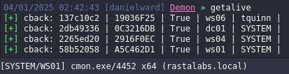
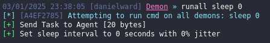
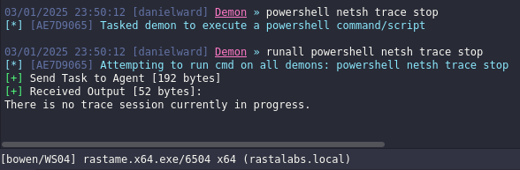
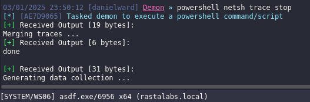

# Havoc runall POC

The following Havoc Module allows the operator to run a command on all connected agents, which could prove useful when searching for something, running post-exploitation on a number of hosts and/or downloading files on all compromised hosts at once.

> [!WARNING]
> There is an issue with some of the automatically imported Havoc bof which causes the client to crash under certain conditions. For example running `runall noconsolation` will crash the client. To fix it you need to import the modules yourself. Copy them from your havoc installation directory, rename the command and import the `.py` script.
> _This is not something I have control over, however from the code updates I've seen, it should be fixed in the Havoc re-write version._

## Commands

> [!NOTE]
> It may be useful to sync beacon sleeps in order to see them report at the same time.

### getalive

The `getalive` command allows you to run a dummy bof on all connected agents so that the beacons can checkin together and update the **Last** check tab of Havoc:



The dummy bof returns the hostname as well as the user it's running under.

#### usage

```
getalive
```

### runall

The `runall` command allows you to execute commands on all agents, for example syncing their sleep:



Another example where I'm using it to stop a netsh trace that was started on all connected beacons. The console where the `runall` command was execute show's the `runall` command and the command that was executed, all other agent consoles will only show the command itself. All agents will have the same task so you can cross-reference where the command was ran from.

Main agent (task id = "AE7D9065"):



Another agent (task id = "AE7D9065"):



#### usage

```
runall <command to run>
```

*The command to run does not need to delimited with `"` or `'`, simply type in the command you would have typed if you were to run it normally (ie. on a single host).*

## Extending the module

The code has additional examples and more comments if you wish to extend it, or explore how to do this. YMMV, this is only a POC.
